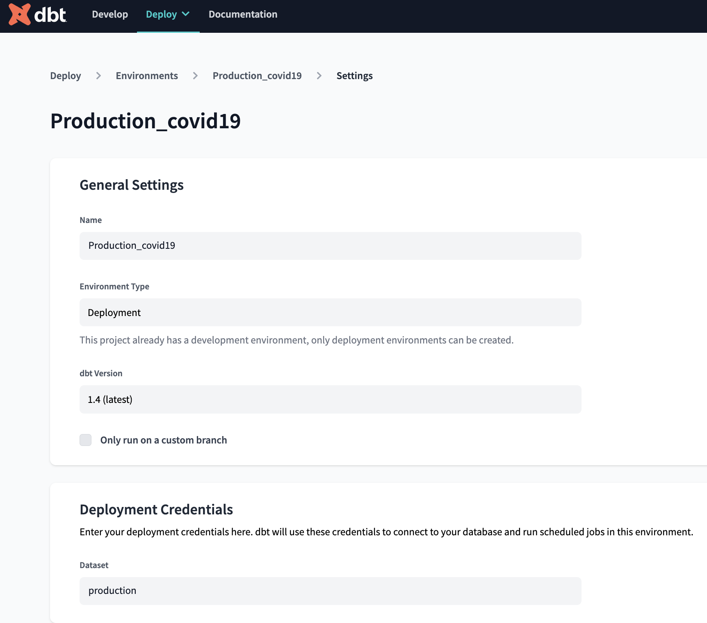
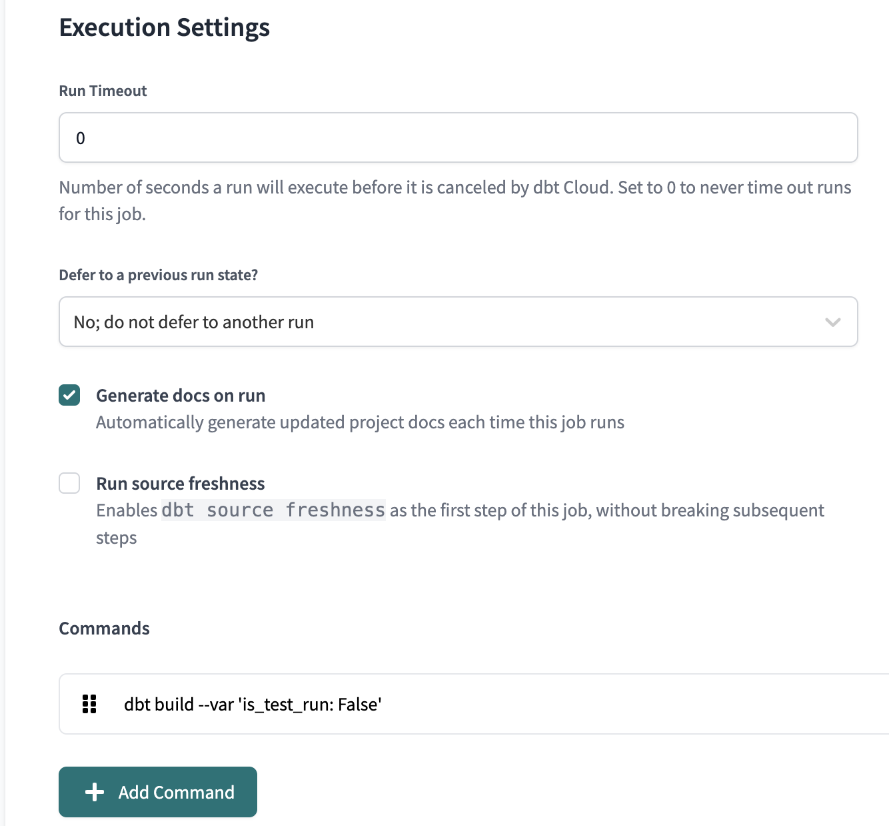

## Initial set up in Google Cloud Platform (GCP)

### *Step 1* Install Terraform on your local machine

Choose version for your OS: [Link to Terraform](https://developer.hashicorp.com/terraform/downloads?product_intent=terraform)

Don't forget to unzip it next (MacOS/Linux): `unzip terraform_1.3.9_linux_amd64.zip`

Confirm that Terraform is installed: `terraform -version`

FOr MacOS/Linux, if it does not work for you, move terraform: `sudo mv terraform /usr/local/bin/`

### *Step 2* Create a new project in GCP UI

Go to https://console.cloud.google.com/ and follow the instructions.

### *Step 3* Install Google SDK on you local machine

Choose the compatible version for your OS: [Download Google Cloud SDK](https://cloud.google.com/sdk/docs/install)

### *Step 4* Creating resourses in GCP using Terraform from local machine

 *4.1* Clone repo
 
 `git clone https://github.com/MikhailKuklin/data-pipeline-COVID19-monitoring.git`

 *4.2* Create service account 
 
 It has to be created for Terraform to give it the credentials to required services in GCP

 Easiest option is to use cli:

 ```sh
 gcloud auth login # OAuth 2 to GCP
 ```

 Next, run ´create_service_account.sh´ by adding your project ID from GCP:
 
 ```sh
 cd data-pipeline-COVID19-monitoring/scripts
 sh create_service_account.sh GCP_PROJECT_ID
 ```
 
 This code will:
 
  ```sh
 - create service account
 - define the roles for service account using gsutil
 - create json key for it
 - save it in ../.gc folder
 - set the path to json to interact with GCP from local machine
 ```

 Next, just run:

 ```sh
 gcloud auth application-default login
 ```

 *4.3* Create resources
 
 NOTE that you need to change in `variables.tf` at least `variable "project"` and perhaps `variable "region"` and `variable "zone"`
 
 ```sh
 cd data-pipeline-COVID19-monitoring/infrastructure/with_vm
 terraform init
 terraform plan
 terraform apply
 ```

 Terraform will create virtual machine, google cloud storage bucker, and BigQuery dataset for you.

### (Optional) *Step 5* Create and upload to GCP a ssh key to log in to the VM in GCP without typing a password

In order to avoid typing the password to log in to the VM from the local machine, one can create ssh key on the local machine:

For Linix and MacOS: `ssh-keygen -t rsa -f ~/.ssh/KEY_FILENAME -C USERNAME -b 2048` (key is generated in ~/.ssh)

For Windows, look for more details here: [Create SSH Keys](https://cloud.google.com/compute/docs/connect/create-ssh-keys)

Next, copy and upload the public ssh key to GCP: Go to GCP -> Compute Engine -> Metadata -> SSH Keys -> Add SSH Key

### (Optional) *Step 6* ssh config on the local machine for the instance 

Create config file on the PC to config access to the server (to avoid the full command to enter the VM)

Create a file ~/.ssh/config:

  ```sh
  Host de-zoomcamp # name of the VM
        Hostname 35.228.114.109 # external IP of the VM
        User mikhail # user name which was used to generate the ssh key
        IdentityFile ~/.ssh/gcp # path to the ssh key. Note that it has to be absolute path for Windows
  ```

Now it is possible to ssh to the VM by typing: `ssh de-zoomcamp` (otherwise it is: `ssh -i ~/.ssh/gcp de-zoomcamp`)

### *Step 7* Necessary installations on the VM

 *7.1* To simplify the process, it is suggested to install [Anaconda package management](https://www.anaconda.com/products/distribution):

 ```sh
 wget https://repo.anaconda.com/archive/Anaconda3-2022.10-Linux-x86_64.sh

 bash Anaconda3-2022.10-Linux-x86_64.sh
  
 source .bashrc
 ```

 *7.2* Clone repo and install packages

```sh
git clone https://github.com/MikhailKuklin/data-pipeline-COVID19-monitoring.git
cd data-pipeline-COVID19-monitoring
conda create -n conda-env
conda activate conda-env
conda install pip
pip install -r requirements.txt
```

### *Step 8* Prefect setup
  
Run in the command line of VM `prefect orion start` that will start Prefect UI and go to the address given after execution of the command (`http://127.0.0.1:4200` in my case). Note that you also can use Prefect Cloud which will be forever connected to your account.

To allow Prefect orchestrate the pipeline, one has to give permissions to Prefect to access other services. For that, one has to set up `Blocks` in Prefect. The blocks have to be created for:

```sh
GCP Bucket
GCP Credentials
```

Run the script by copying and adding `json` key (data-pipeline-COVID19-monitoring/.gc/sa-iam.json ON YOUR LOCAL MACHINE) to `make_gcp_block.py` and changing `project_id`:

```sh
cd scripts/
python make_gcp_block.py
```

!NOTE: do not push to GitHub the script with your credentials inside

### (Optional if not using dbt Core) *Step 9* dbt cloud setup
  
In case if one is interested using [dbt Cloud version](https://www.getdbt.com/blog/introducing-dbt-cloud/) for having UI and more functionalities compared with dbt core, follow the instructions below.

*9.1* To setup dbt Cloud with Big Query, follow detailed instructions from [this guideline](https://github.com/DataTalksClub/data-engineering-zoomcamp/blob/main/week_4_analytics_engineering/dbt_cloud_setup.md)

*9.2* Create prefect-dbt block if you want to use Prefect

Use ./gc/sa-iam.json key

```sh
cd scripts/
python make_dbt_block.py
```

*9.3* When you are in dbt Cloud, initialize the project. Next, in order to create a job, one has to first create **Environment**:

In dbt Cloud UI, choose Deploy -> Environments:



Next, choose Deploy -> Jobs:




Note that two threads are used as two models are run. Finally, create deployment with Prefect to run the job every day at 11 UTC time:

`prefect deployment build trigger_dbt.py:run_dbt_job_flow -n 'COVID19 data dbt job' --cron "0 11 * * *" -a`

This job will update gold layer table in Big Query with daily data.
